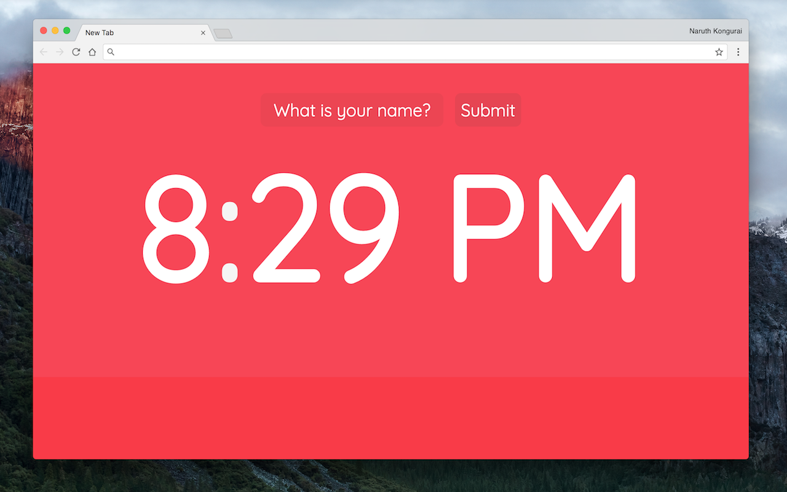

#  Beautiful Digital Clock

## What Is It?

**A beautiful new tab page that displays a digital 12-hour format clock.**

Are you bored of your current New Tab page? Why don't you try out this beautiful color-changing New Tab page? Whenever you launch a new tab, a digital clock is displayed. And the background slowly changes from one bright color to another.

It's a wonderful and simple page made to delight and enhance your browsing experience!

## Download

The extension is available for installation from the [Google Chrome Web Store](https://chrome.google.com/webstore/detail/beautiful-digital-clock-w/jdnjafgehddcpoahelddbflpmoeinaed?hl=en-US&gl=US).

## Code Pen Version

If you just want to see a demo of it in your browser without installing the extension, check out the [Code Pen version](https://codepen.io/naruthk/full/jaqdwW/).

## License

MIT License. See [LICENSE file](LICENSE.md) for complete information.